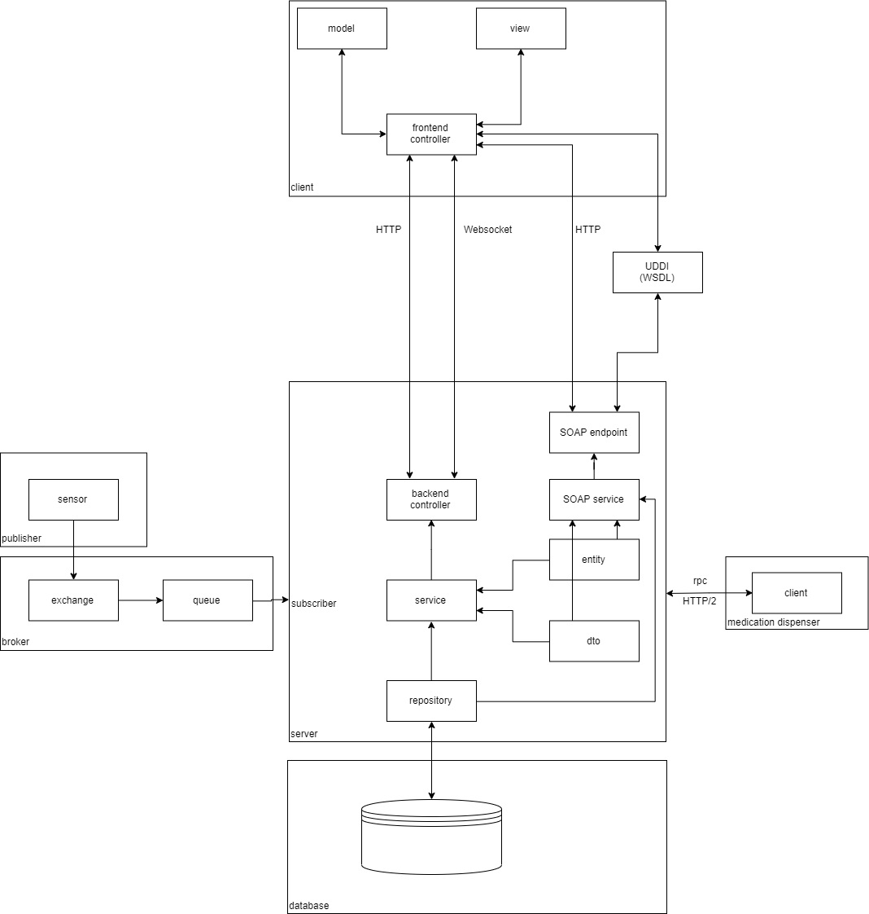
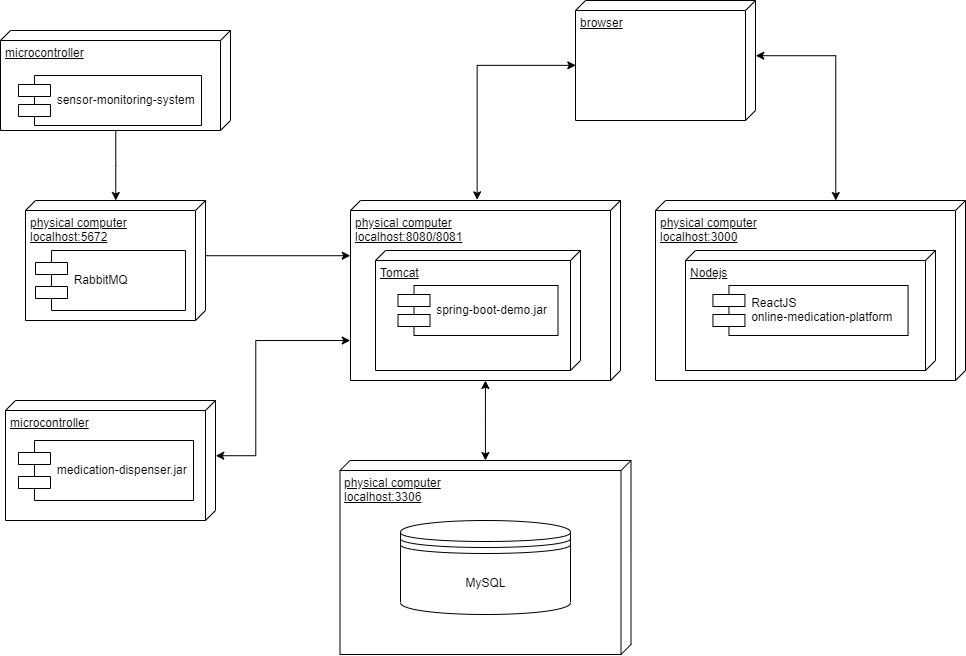
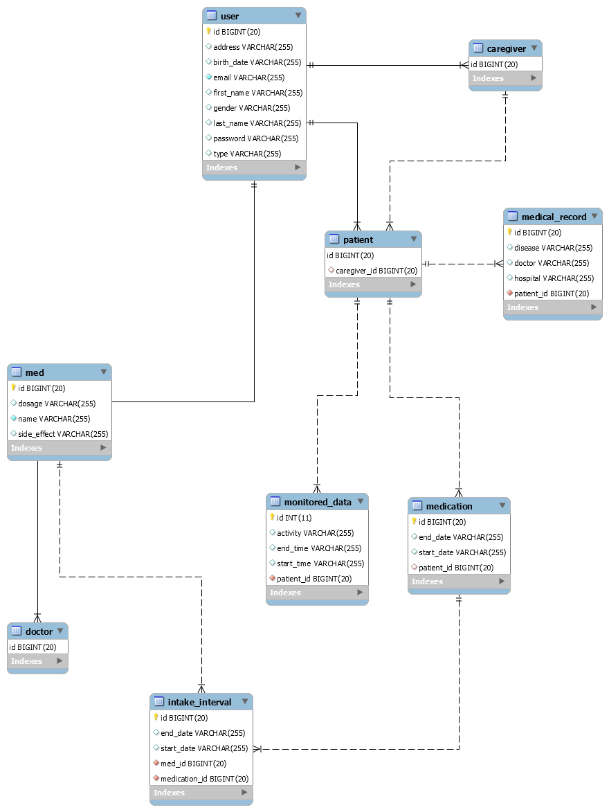

# Online Medication Platform  
The frontend and the backend of an online medication platform that allows doctors to monitor patients in real-time and prescribe medication.  

## Description
The backend is implemented in Java with Spring Boot adhering to OOP principles. 
Monitoring devices record and send patients' data to a RabbitMQ broker which are forwarded to the backend.
The frontend is developed in ReactJS, Websockets to notify patients when to take their meds.
The medication dispenser communicates with the backend using gRPC.

## System Architecture  

## Deployment Diagram  

## Database Design

